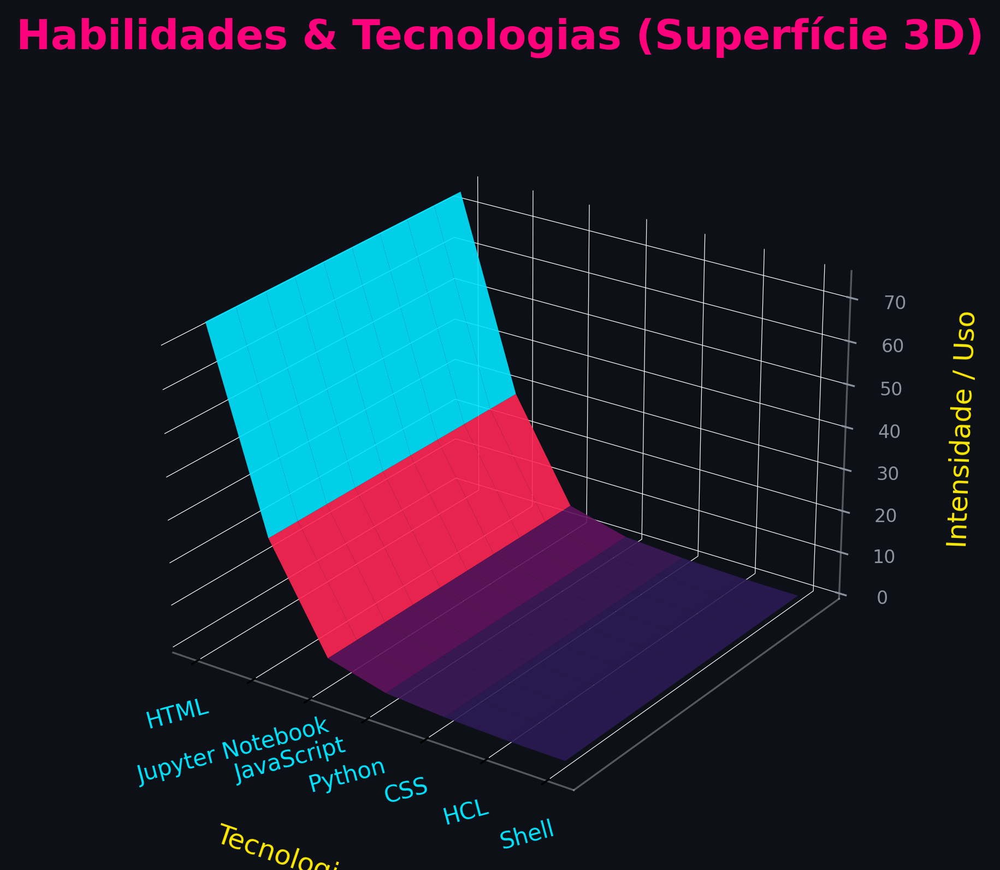
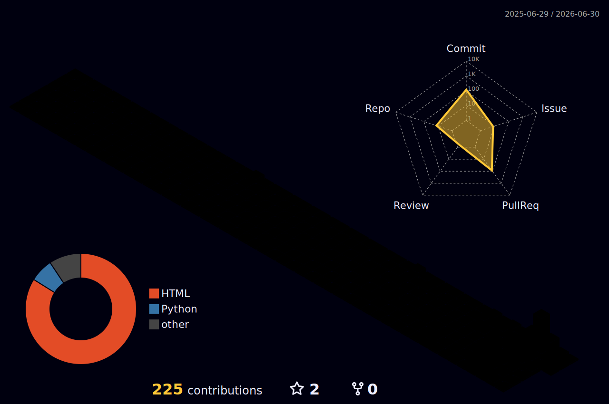

<!-- Header Personalizado GTA VI -->

  

 

  

---

### 🌴 Sobre Mim
Sou um **Data Engineer** apaixonado por tecnologia e dados. Foco em arquitetar soluções escaláveis, construir pipelines eficientes e extrair o máximo de valor dos dados (agora trabalhando diretamente de Leonida! 🌴🚗).

### ☀️ Conhecimentos e Tecnologias

  
  
  
  
  
  

### 📜 Certificações

  
  

### 🌆 Gráfico de Superfície 3D (GTA VI Theme)

  <!-- O Gráfico 3D contínuo gerado pelo script Python de Data Engineering! -->
  

  <!-- O Gráfico 3D nativo do plugin com cores lindas de Sunset/Neon! -->
  

---

  

